#README_ACR_AKS

# 🎓 Capstone Project: Tuition Centre CMS on Azure Kubernetes Service (AKS)

### 🧩 Overview

This repository demonstrates an end-to-end **DevOps and DevSecOps workflow** for deploying a **containerized Tuition Centre Content Management System (CMS)** on **Azure Kubernetes Service (AKS)**.

It simulates how an enterprise would provision infrastructure, automate deployments, and enforce security at scale using **Terraform, Helm, GitHub Actions, and Azure services**.

> 🔍 Focus: Cloud-native DevOps automation — not app logic.
>
> The goal is to showcase secure CI/CD, IaC, and AKS deployment patterns aligned with production-grade Azure environments.

---

### 🚀 Key Outcomes

✅ **Infrastructure as Code (IaC):**

Automated provisioning of Azure resources (AKS, ACR, VNet, NSGs, UAMI, PostgreSQL) using modular **Terraform** templates.

✅ **CI/CD Automation:**

End-to-end GitHub Actions pipeline to **build, scan, push, and deploy** container images to AKS using **Helm charts**.

✅ **Security-First DevOps:**

Adopted **Managed Identity** for image pulls, **shift-left scanning** (Trivy, tfsec), and **private networking** for DB access.

✅ **Troubleshooting Mindset:**

Documented real-world challenges (AKS ↔ PostgreSQL private endpoint connectivity) and pragmatic engineering trade-offs.

✅ **Future-State Architecture:**

Proposed a **multi-node, production-grade AKS design** with Front Door + WAF, App Gateway, Prometheus, Grafana, and Key Vault integration — scalable for **10K–100K concurrent users**.

---

### 💡 My Role

- Designed and authored all Terraform modules (ACR, AKS, IAM, PostgreSQL, storage backend).
- Implemented CI/CD workflow with GitHub Actions and Helm deployment automation.
- Configured AKS Managed Identity for secure image pulls (AcrPull role).
- Troubleshot networking and DNS issues for Private Endpoint integration.
- Produced detailed documentation to reflect **enterprise DevSecOps practices**.

---

### 🧱 Tech Stack Summary

| Category          | Tools & Services                                              |
| ----------------- | ------------------------------------------------------------- |
| **Cloud**         | Azure (AKS, ACR, Front Door, App Gateway, Key Vault, Monitor) |
| **IaC**           | Terraform (modular, remote backend)                           |
| **CI/CD**         | GitHub Actions (build, scan, deploy)                          |
| **Orchestration** | Helm, Kubernetes                                              |
| **Security**      | UAMI, tfsec, Trivy, OPA/Conftest, Private Endpoints           |
| **Monitoring**    | Prometheus, Grafana, Azure Monitor                            |
| **App Layer**     | Next.js (containerized microservice demo)                     |

---

### 🗺️ Architecture Summary (Demo vs Future State)

| Environment                 | Description                                                                                          |
| --------------------------- | ---------------------------------------------------------------------------------------------------- |
| **Demo (Current)**          | Single-node AKS cluster running containerized CMS with in-cluster PostgreSQL (Bitnami Helm chart).   |
| **Proposed (Future State)** | Multi-node AKS with managed PostgreSQL Flexible Server (Private Link), Front Door + WAF, Key Vault, and full observability stack for 100K users. |

---

## 🧱 Infrastructure as Code (Terraform)

The IaC configuration automates Azure resource provisioning, including:

- Resource Group
- Virtual Network and Subnets
- Network Security Groups (NSGs)
- Azure Container Registry (ACR)
- Azure Kubernetes Service (AKS)
- Managed Identity (UAMI) and RBAC assignments

<details>
<summary><b>📘 Terraform Example Workflow (Click to Expand)</b></summary>

```bash
terraform init
terraform plan -out=tfplan
terraform apply "tfplan"
```

> 💡 Best Practice: Always review with terraform plan before applying.

</details>

> 📘 For full technical walkthrough, Terraform modules, and troubleshooting logs — see below.

---

## 🗄️ Database Setup and Decision

Originally, the goal was to use **Azure Database for PostgreSQL Flexible Server** with a private endpoint and DNS zone to simulate a production-grade database setup.

However, due to private-network constraints in the sandbox, an **in-cluster Bitnami PostgreSQL** was used to preserve functionality while maintaining secure architecture intent.

> 🧩 This pivot highlights real-world decision-making under constraints — balancing time, cost, and functionality.

---

## 🚀 CI/CD Pipeline (GitHub Actions)

Automated pipeline stages:

1. 🧩 **Build & Test** – Docker image build and unit tests
2. 🔍 **Security Scanning** – Secrets and container scan (Trivy)
3. 📦 **Publish** – Push image to ACR
4. 🚢 **Deploy** – Deploy to AKS using Helm

<details>
<summary><b>🧩 Example GitHub Actions Workflow (Click to expand)</b></summary>

```yaml
name: CI-CD Pipeline
on:
  push:
    branches: [ "starter" ]
jobs:
  build:
    runs-on: ubuntu-latest
    steps:
      - uses: actions/checkout@v4
      - name: Build Docker Image
        run: docker build -t tuitionapp:${{ github.sha }} .
      - name: Run Security Scan
        run: trivy image tuitionapp:${{ github.sha }}
      - name: Push to ACR
        run: |
          az acr login --name <your_acr_name>
          docker push <your_acr_name>.azurecr.io/tuitionapp:${{ github.sha }}

```

</details>

---

## 🌐 Future-State AKS Architecture (Proposed Design)

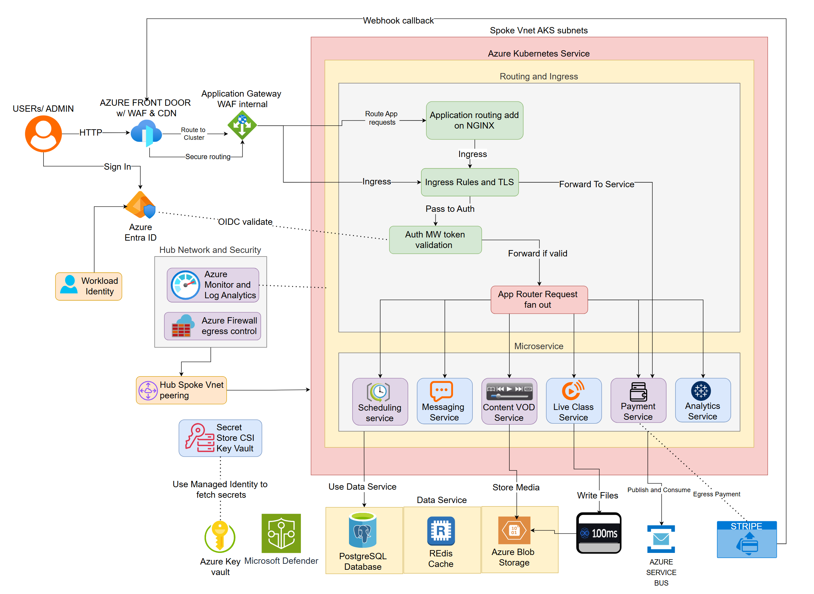

<details>
<summary><b>🧭 Key Design Highlights (Click to Expand)</b></summary>

### ⚙️ Scalability

- Multi-node pools, HPA, Cluster Autoscaler
- Rolling updates for zero downtime

### 🔐 Security

- Azure Front Door + WAF
- Application Gateway Ingress Controller
- Private Endpoints for DBs and ACR
- Managed Identity + Key Vault CSI
- NAT Gateway for stable egress

### 📊 Observability

- Prometheus + Managed Grafana
- Azure Monitor + Log Analytics
- Custom alerts on latency, cost, and error rates

### 🧱 DevSecOps Practices

- IaC scan (tfsec, Checkov)
- Container scan (Trivy)
- Policy-as-Code (OPA, Conftest)
- Image signing (Cosign)

</details>

🧩 Repository Structure

```bash
📁 infra/
 ├── tf-acr/            # ACR provisioning
 ├── tf-aks/            # AKS cluster setup
 ├── tf-aks-storage/    # Terraform state storage
 ├── tf-iam/            # Managed Identity & role assignments
 └── tf-postgres/       # PostgreSQL Flexible Server (private endpoint)

📁 helm/
 ├── tuition-no-worry/       # Helm chart for app deployment
 └── values.yaml        # Environment-specific overrides

📁 .github/workflows/  			# CI/CD pipeline definition
 ├── secret-scan.yml/			# Detects secrets in code
 ├── acr-admin-build-push.yml 	# Builds and pushes images (commented out for safety)
 └── ci-deploy-acr-aks.yml		# Deploys app to AKS (commented out for safety)
```

Artifacts: `Dockerfile`, `entrypoint.sh`, `schema.sql`, `seed.sql`, `run-sql-seed.js`

---

## 🧭 Troubleshooting & Decision Log

Documented real-world debugging of **AKS ↔ PostgreSQL private endpoint** failures, DNS resolution issues, and image pull errors.

Final pivot to **in-cluster PostgreSQL** stabilized demo and preserved full DevOps workflow (Docker → ACR → AKS → Helm).

> 🎯 Reinforces problem-solving mindset essential for production DevOps environments.

---

## 🔐 Security Notes

- UAMI for least-privilege ACR pulls
- Private endpoints to isolate DB
- Key Vault or Helm secrets for sensitive data
- OIDC or SPN for CI/CD credentials
- Enforce Azure Policy add-ons for compliance

---

## 🚀 Future Improvements

1. **Private DB Connectivity:** Reinstate Azure PostgreSQL Flexible Server (Private Link + UAMI).
2. **IaC Enhancements:** Integrate tfsec/checkov gates, remote state validation, and plan approvals.
3. **Observability:** Expand Grafana dashboards and Azure Monitor alerts.
4. **Scalability Testing:** Implement HPA, PDBs, and multi-node load tests.
5. **Security Hardening:** Cosign image signing, SBOMs, namespace isolation.

---

## 🧩 Cleanup

```bash
cd tf-acr && terraform destroy -auto-approve
cd tf-postgres && terraform destroy -auto-approve
cd tf-aks && terraform destroy -auto-approve
cd tf-aks-storage && terraform destroy -auto-approve
cd tf-iam && terraform destroy -auto-approve

```

---

> 🧠 This project extends beyond coursework to demonstrate real-world DevOps thinking — automation, security, scalability, and iterative improvement.

---

## Preflight Azure checklist

Install tools:

```bash
# tools
terraform version v1.13.3 on linux_amd64
az cli version v2.77.0
Docker Desktop v4.46.0
Docker Client v28.4.0
kubectl version --client v1.34.0
helm version v3.19.0
```

Login to Azure and set subscription

```bash
az login
az account set --subscription "<YOUR_SUBSCRIPTION_ID_OR_NAME>"
# to ensure ResourceManagerAccount -subscriptionID issues are handled beforehand
export ARM_SUBSCRIPTION_ID=$(az account show --query id -o tsv | tr -d '\r' | xargs)
```

Optional: Create an automation Service Principal (for CI)

```bash
az ad sp create-for-rbac --name "tnw-sp" --role Contributor --sdk-auth > tnw-sp.json
# Save tnw-sp.json securely and add its values to CI secrets
```

Register resource providers (run once per subscription)

```bash
az provider register --namespace Microsoft.ContainerRegistry
az provider register --namespace Microsoft.ContainerService
az provider register --namespace Microsoft.DBforPostgreSQL
az provider register --namespace Microsoft.Network
az provider register --namespace Microsoft.Storage
az provider register --namespace Microsoft.ManagedIdentity
az provider register --namespace Microsoft.Authorization
```

## Quick-demo flow

Follow this order to provision resources and deploy the app

# 🧭 Setup Steps
<details>
<summary><b> >>>>> (Click to Expand) <<<<< </b></summary>

### 1) `tf-aks-storage` (`tfstate` + storage RG)

```bash
MAIN_RG=tnw-rg
STORAGE_RG=tnw-storage-rg
LOCATION=eastus
az group create --name "$MAIN_RG" --location "$LOCATION"
az group create --name "$STORAGE_RG" --location "$LOCATION"
```

```bash
cd infra/tf-aks-storage

terraform init
terraform apply -auto-approve -var="resource_group_name=$STORAGE_RG" -var="location=$LOCATION" -var="storage_account_name=tnwstate$(date +%s)"

# Capture outputs from tf-aks-storage so other modules can reference the same storage account
STORAGE_ACCOUNT_NAME=$(terraform output -raw storage_account_name)
STORAGE_ACCOUNT_RG=$(terraform output -raw resource_group_name || echo "$STORAGE_RG")
STORAGE_ACCOUNT_CONNSTR=$(terraform output -raw storage_account_primary_connection_string)
```

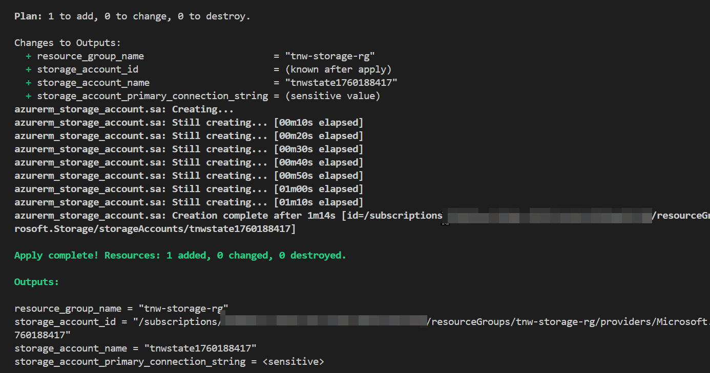

tnw-storage-rg creation completed

The storage account created by `tf-aks-storage` should be used for Terraform state across the other modules. 

### 2) Create the user-assigned managed identity (`UAMI`)

```bash
MAIN_RG=tnw-rg
LOCATION=eastus
IDENTITY_NAME=tnw-uami
cd ../infra/tf-iam
terraform init
terraform apply -auto-approve -var="resource_group_name=$MAIN_RG" -var="location=$LOCATION" -var="identity_name=$IDENTITY_NAME"

UAMI_ID=$(terraform output -raw uami_id | tr -d '\r' | xargs)
UAMI_PRINCIPAL_ID=$(terraform output -raw uami_principal_id | tr -d '\r' | xargs)
```

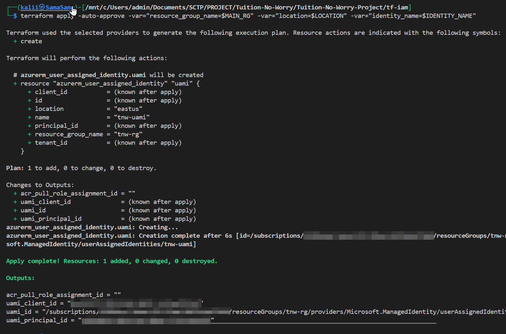

uami creation completed

### 3) Create AKS and attach the UAMI (tf-aks)

## User-Assigned Managed Identity

Pass `UAMI_ID` into `tf-aks` so AKS is created with the user-assigned identity.

```bash
cd ../infra/tf-aks
# Create the container (preferred if you have proper RBAC):
az storage container create --name tfstate --account-name <storeage-name> --auth-mode login

terraform init \
  -backend-config="resource_group_name=tnw-storage-rg" \
  -backend-config="storage_account_name=<your-storage-acc-name>" \
  -backend-config="container_name=tfstate" \
  -backend-config="key=tf-aks.terraform.tfstate"
  
# supply required root variables via env or -var and import
export TF_VAR_resource_group_name="tnw-rg"
terraform import 'azurerm_resource_group.rg' '/subscriptions/<subscription-id>/resourceGroups/tnw-rg'
  
terraform apply -auto-approve -var="resource_group_name=$MAIN_RG" -var="location=$LOCATION" -var="uami_id=$UAMI_ID"
# Capture outputs
VNET_ID=$(terraform output -raw vnet_id | tr -d '\r' | xargs)
AKS_SUBNET_ID=$(terraform output -raw aks_subnet_id | tr -d '\r' | xargs)
```

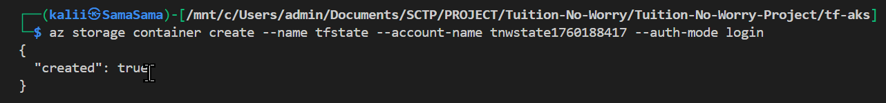

az storage container creation completed

Notes:

- AKS is created with a user-assigned identity attached; this UAMI will be used to pull from ACR.
- Ensure AKS has system-managed identity enabled if you need it; current setup attaches UAMI for image pull.

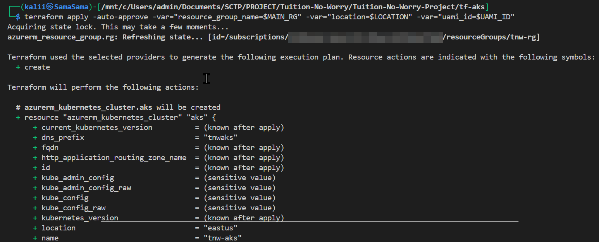

AKS creation

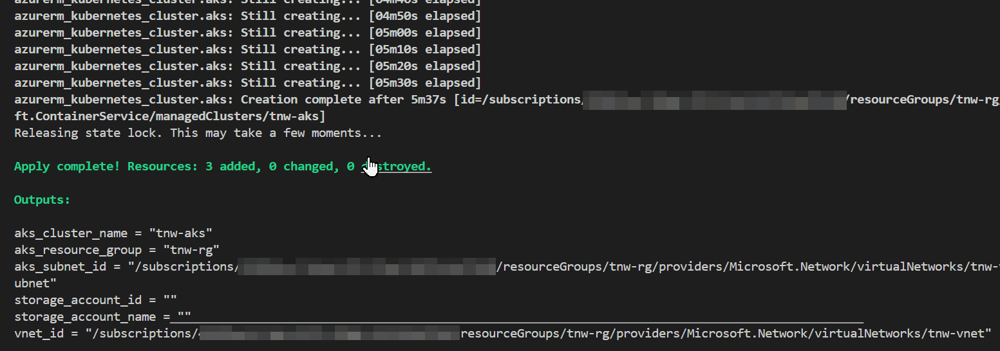

AKS creation completed

### 4) Create ACR (`tf-acr`)

```bash
# ensure registry name is globally unique
ACR_NAME=tnwregistry$RANDOM 
cd ../infra/tf-acr

terraform init \
  -backend-config="resource_group_name=tnw-storage-rg" \
  -backend-config="storage_account_name=<THE_STORAGE_ACCOUNT_NAME>" \
  -backend-config="container_name=tfstate" \
  -backend-config="key=tf-acr.terraform.tfstate"

terraform import \
  -var="resource_group_name=$MAIN_RG" \
  azurerm_resource_group.rg /subscriptions/<$SUBSCRIPTION_ID>/resourceGroups/$MAIN_RG
  
terraform apply -auto-approve -var="resource_group_name=$MAIN_RG" -var="acr_name=$ACR_NAME" -var="location=$LOCATION"

# get ACR_ID from tf-acr directory
ACR_ID=$(terraform -chdir=../tf-acr output -raw acr_resource_id)
# get ACR_LOGIN from tf-acr directory
ACR_LOGIN=$(terraform -chdir=../tf-acr output -raw acr_login_server)
```

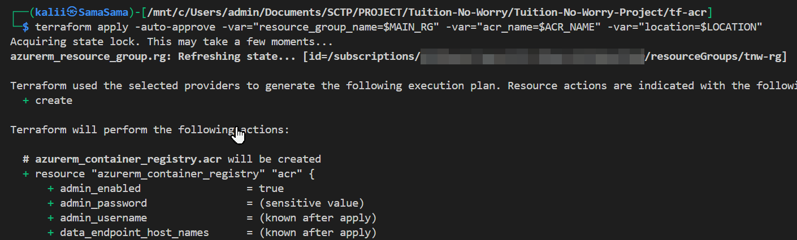

ACR creation

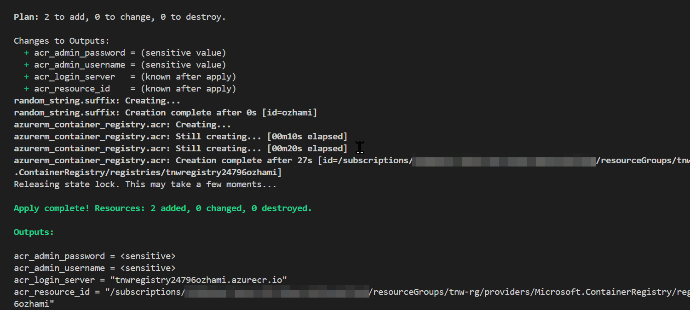

ACR creation completed

### 5) Grant AcrPull to the UAMI (re-run `tf-iam` or use dedicated role assignment)

Run tf-iam again (it will create the role assignment if `acr_resource_id` is provided):

```bash
cd ../infra/tf-iam
terraform apply -auto-approve \
  -var="resource_group_name=$MAIN_RG" \
  -var="location=$LOCATION" \
  -var="identity_name=$IDENTITY_NAME" \
  -var="acr_resource_id=$ACR_ID"
```

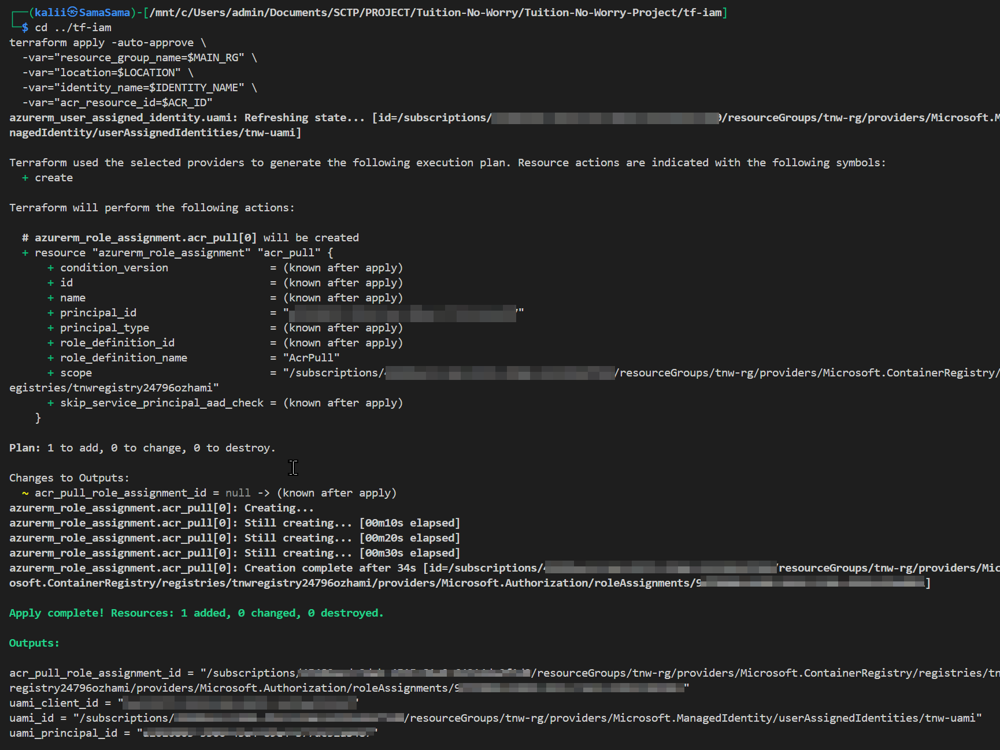

ACRpull assignment completed

Verify role assignment:

```bash
# using the output for uami_principal_id
UAMI_PRINCIPAL_ID="<uami-princpal-id from output>"
ACR_ID=$(terraform -chdir=../tf-acr output -raw acr_resource_id)
az role assignment list --assignee "$UAMI_PRINCIPAL_ID" --scope "$ACR_ID" -o table
```

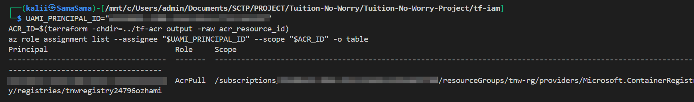

Verification of ACRpull

### 6) Provision PostgreSQL Flexible Server with private endpoint (`tf-postgres`)

### 💡 Note:

Database setup was eventually changed to in-cluster Bitnami Postgres for Demo

> The intended setup for this project uses **Azure Database for PostgreSQL Flexible Server** with a **Private Endpoint** to demonstrate secure, production-grade networking.
>
> However, due to private networking constraints and time limitations, the live demo uses an **in-cluster Bitnami PostgreSQL Helm chart** to simulate the database connection within AKS.
>
> This substitution preserves functional correctness of the deployment (Docker → ACR → AKS pipeline) while maintaining realistic architecture flow.

Note: The steps I took are laid out here as per my encounter, until the later decision to switch to the in-cluster PostgreSQL

Ensure you pass the AKS VNet ID and a subnet for the private endpoint (pe_subnet_id). Use the VNet created by tf-aks or a peered VNet.                   

```bash
PG_SERVER=tnw-pg-private-$RANDOM
cd ../infra/tf-postgres
terraform init
```

```bash
RG="tnw-rg"
VNET_NAME="tnw-vnet"

# get subnet name in case you forgotten
az network vnet subnet list -g $RG --vnet-name $VNET_NAME --query '[].{name:name,id:id,addr:addressPrefix}' -o table
```

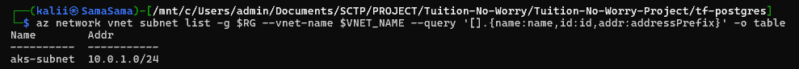

aks-subnet check

```bash
SUBNET_NAME="aks-subnet"

export VNET_ID=$(az network vnet show -g $RG -n $VNET_NAME --query id -o tsv | tr -d '\r')
export PE_SUBNET_ID=$(az network vnet subnet show -g $RG --vnet-name $VNET_NAME -n $SUBNET_NAME --query id -o tsv | tr -d '\r')

# verify
echo "VNET_ID=$VNET_ID"
echo "PE_SUBNET_ID=$PE_SUBNET_ID"

export TF_VAR_server_name=$PG_SERVER
export TF_VAR_vnet_id=$VNET_ID
export TF_VAR_pe_subnet_id=$PE_SUBNET_ID

```

```bash
terraform apply -auto-approve \
  -var="resource_group_name=$MAIN_RG" \
  -var="server_name=$PG_SERVER" \
  -var="public_access=false" \
  -var="vnet_id=$VNET_ID" \
  -var="pe_subnet_id=$PE_SUBNET_ID" \
  -var="create_k8s_secret=false"
```

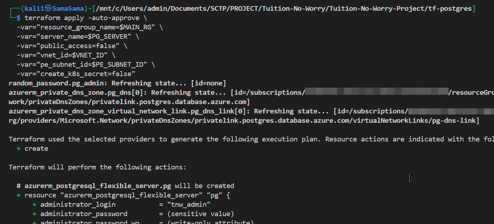

PostgreSQL server creation

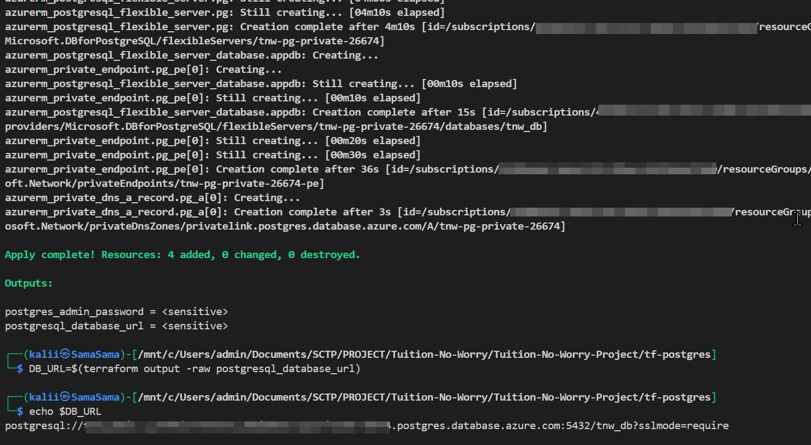

PostgreSQL server creation completed.

Capture DB output:

```bash
# take note of this info. will be needed later on.+
DB_URL=$(terraform output -raw postgresql_database_url)
```

All resources in AZ portal at this point:

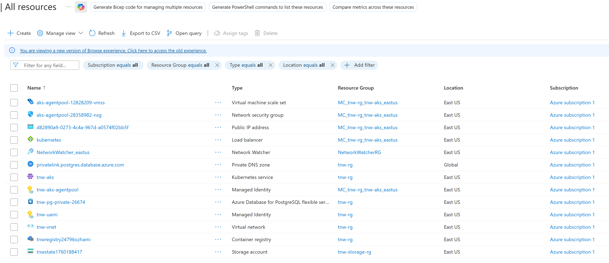

all resources in AZ portal

Notes:

- The module creates a Private Endpoint and a Private DNS zone (privatelink.postgres.database.azure.com) linked to the AKS VNet so pods will resolve the DB FQDN to the private IP.

### 7) Create Kubernetes secret

Run this from a machine that has kubeconfig for the AKS cluster (or use a pod/jumpbox in the VNet):

```bash
RG="tnw-rg"
AKS="tnw-aks"

# go to system root
cd
# connect to az k8's kubectl , not our own local kubectl
# Temporarily for the session  
# Set KUBECONFIG to the file az aks get-credentials wrote.
export KUBECONFIG="$HOME/.kube/aks-$AKS"
kubectl config get-contexts
kubectl config current-context
kubectl get nodes
```


setting up connection to k8s node’s `kubectl`

```bash
# create namespace tnw
kubectl create namespace tnw

# db-url secret needed for app to read/write to postgres, and placed in tnw namespace
kubectl create secret generic tnw-database-url \
--from-literal=DATABASE_URL="$DB_URL" \
--namespace tnw

# clerk (login-plugin) used by app, secret key
# this is from instructions in README, as our app uses Clerk to login, 
# hence the need to set this up as per README.md
kubectl create secret generic tnw-clerk-secret \
  --from-literal=CLERK_SECRET_KEY='sk_secret-***********************' -n tnw
```

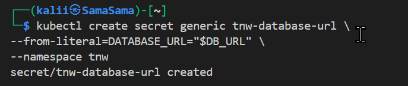

secret for database completed

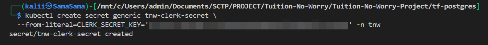

secret for clerk (authentication needed by app) completed

## 8) set up jump server to add user in private postgres server for app

As our app uses a specific credentials to login to postgres, to accomodate that, we need to go into our postgres server to create this user, and because its a private server, we cannot ssh in directly and have to use a VM on the same Vnet to connect to it.

```bash
RG="tnw-rg"
VM_NAME="jump-vm"
ADMIN_USER="azureuser"
VNET_NAME="tnw-vnet"
SUBNET_NAME="aks-subnet"

az vm create \
  --resource-group $RG \
  --name $VM_NAME \
  --image UbuntuLTS \
  --admin-username $ADMIN_USER \
  --vnet-name $VNET_NAME \
  --subnet $SUBNET_NAME \
  --generate-ssh-keys \
  --size B_Standard_B1s \
  --public-ip-address-allocation Static
  
# open ssh port on vm created
az vm open-port --resource-group $RG --name $VM_NAME --port 22
  
# get the public IP of VM
az vm show -d -g $RG -n $VM_NAME --query publicIps -o tsv
  

# chmod the .pem key first
sudo chmod 400 <vm-name>.pem
  
# ssh into jump vm
ssh  -i <path-to-.pem-file>@<ip-of-vm>
  
# do a sudo apt update & install postgresql-client
sudo apt update
sudo apt install -y postgresql-client

# connect to postgres server
psql "host=<server-fqdn> port=5432 user=<admin_user> dbname=postgres sslmode=require"

# upon logging in, create db, user, password needed for app use
CREATE ROLE myuser WITH LOGIN PASSWORD 'mypassword' CONNECTION LIMIT 50;
CREATE DATABASE mydb OWNER myuser;

# go to mydb
\c mydb

# ensure schema exists and is owned/granted
CREATE SCHEMA IF NOT EXISTS public AUTHORIZATION myuser; GRANT USAGE ON SCHEMA public TO myuser;
CREATE SCHEMA IF NOT EXISTS public AUTHORIZATION myuser;

# grant privileges on existing tables/sequences
GRANT USAGE ON SCHEMA public TO myuser;
GRANT CONNECT ON DATABASE mydb TO myuser;
ALTER DEFAULT PRIVILEGES IN SCHEMA public GRANT SELECT, INSERT, UPDATE, DELETE ON TABLES TO myuser;
ALTER DEFAULT PRIVILEGES IN SCHEMA public GRANT USAGE ON SEQUENCES TO myuser;

# exit out of postgres server
exit

# exit out of jump vm
exit
```

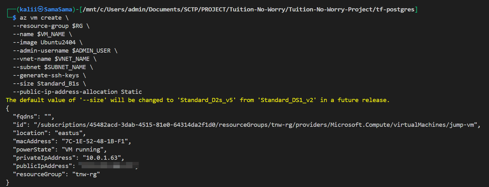

jump vm creation

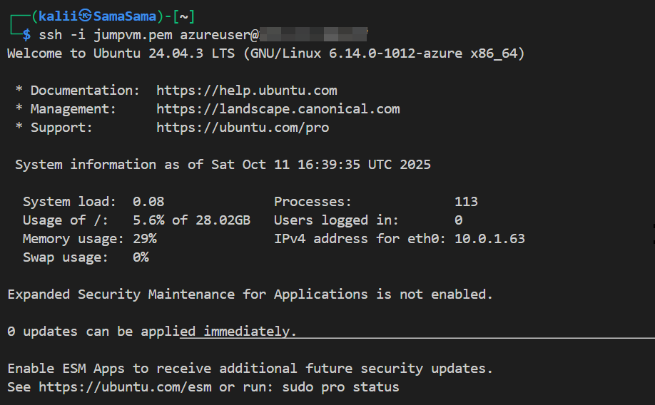

ssh into jump vm


create and confirm user `myuser` and db of `mydb`


granting privileges to `myuser`

### 9) build/push & deploy

```bash
# go to your repo root!
# Replace where relevant for you
ACR_LOGIN_SERVER=<registry.server>
IMAGE_NAME=tuition-no-worry
# set the Git commit ID as the version tag, but if Git isn't available 
# or the current directory isn't a repository, it defaults to the tag latest
NAMESPACE="tnw"              # pick your namespace
RELEASE="tnw"                # Helm release name
TAG=$(git rev-parse --short HEAD 2>/dev/null || echo latest) # e.g. $(git rev-parse --short HEAD)
FULL_IMAGE="$ACR_LOGIN_SERVER/$IMAGE_NAME:$TAG"
echo "Image will be: $FULL_IMAGE"

# login (uses your az login session)
az acr login -n $ACR_LOGIN_SERVER

# please ensure Docker is up and running.
# build and tag, then push
docker build -t "$FULL_IMAGE" .
docker push "$FULL_IMAGE"
```

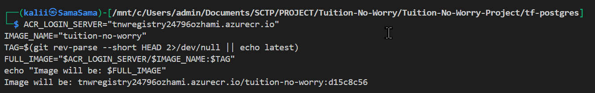

prepping vars for docker image build for ACR

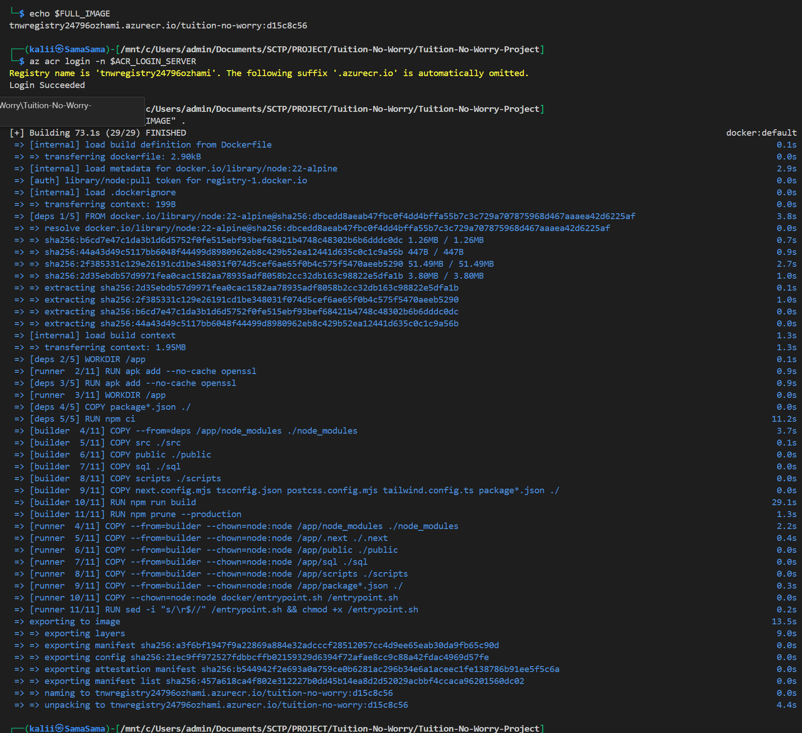

logging into ACR and building image

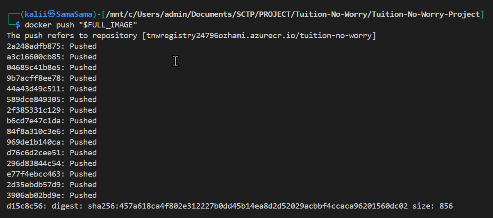

image pushed to ACR

- for simplicity here as a  demo we are using ACR admin creds (less secure). CI should build the Docker image and push to ACR. for higher security - Service Principal or OIDC (OpenID Connect) is preferred.

## Connect ACR to AKS

```bash
az aks update -n <AKS_NAME> -g <RESOURCE_GROUP> --attach-acr <ACR_NAME>
```

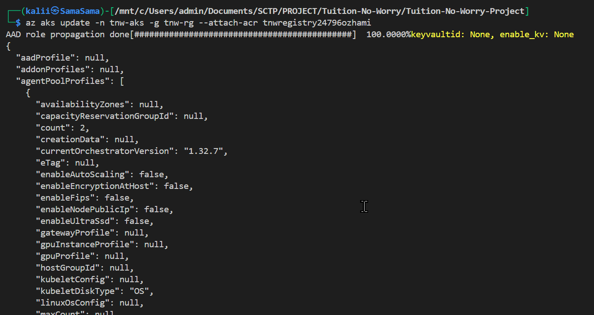

connecting ACR to AKS

## 9) It’s HELM time!!! for deployment

```yaml
# important to take note in values.yaml
# service port 
image:
  repository: "<YOUR_ACR_LOGIN_SERVER>/tuition-no-worry"
  tag: "<GITHUB_SHA_OR_TAG>"
secrets:
  databaseSecretName: "tnw-database-url"
dbMigration:
  enableJob: true  # runs seeder as a job inside cluster (recommended for private DB)
```

note: use the values.example.yaml and rename as values.yaml and fill in your details before use. 

Dry Run Check:

```bash
helm upgrade --install tnw ./charts/tuition-no-worry \
  -f ./charts/tuition-no-worry/values.yaml \
  --namespace tnw --create-namespace \
  --dry-run --debug
```

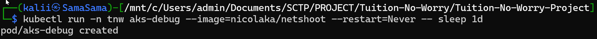

debug pod created to check

Deploy the real deal:

```bash
# Run Helm and set the secret names
helm upgrade --install tnw ./charts/tuition-no-worry \
  -f ./charts/tuition-no-worry/values.yaml \
  --namespace tnw --create-namespace \
  --set secrets.databaseSecretName=tnw-database-url \
  --set secrets.clerkSecretName=tnw-clerk-secret
```

</details>

## 🧭 Troubleshooting & Decision Log

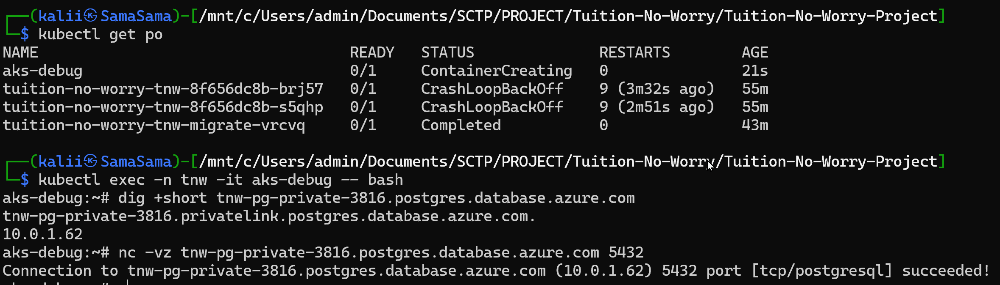

example of an initial issue faced during deployment

Throughout the deployment process, several issues were encountered while attempting to connect the AKS cluster to **Azure Database for PostgreSQL Flexible Server** via a **Private Endpoint**.

These challenges provided valuable learning experience on Azure networking, DNS resolution, and Terraform state management.

### 1. Connectivity Issues Between AKS and PostgreSQL Flexible Server

Initial Terraform deployment for the managed PostgreSQL Flexible Server completed successfully, and the private endpoint was created in the target subnet.

However, application pods within AKS were unable to establish a connection using the private FQDN (e.g., `mydb.postgres.database.azure.com`).

### 2. Deployment notes & troubleshooting (chronological)

During deployment to AKS I encountered multiple environment-specific issues; I list the important ones in order, and explain the final decision to use an in-cluster Postgres for the demo.

Initial problems

Image pull and container runtime issues on some nodes while pulling from ACR (fix: ensure AKS can pull from ACR or attach ACR to the cluster).

**Missing secrets:** 

the app expects several runtime secrets (Clerk keys, DB credentials). Missing publishable keys produced 500s and middleware errors until the **`tnw-clerk-secret`** was created.

**Postgres & readiness issues:**

The app container started before Postgres was reachable. To avoid race conditions I added an `initContainer (pg_isready)` so the app waits for `Postgres port:5432`.

Seeding never ran in the cloud: 

`entrypoint` logic depends on environment and secrets; initially the app attempted to connect to an Azure-managed Postgres and failed.

Secret naming and password mismatch:

Helm/Bitnami produced a secret with keys different from what the app expected (e.g., postgres-password vs postgresql-password). This required harmonizing secret keys or making the app/helm chart read the generated keys.

Password authentication failed against the Azure server (FATAL 28P01). I attempted in-cluster fixes (patching secrets, ALTER USER), but the Azure admin/password semantics and username format (user@server) complicated things.

### 3. Decision to Use In-Cluster PostgreSQL for Demo

After extended nights of troubleshooting, tearing down and rebuilding (to save costs) , and still stuck with connectivity issues to the private postgres server, a decision was made to **pivot to an in-cluster PostgreSQL deployment** to maintain demo continuity. Troubleshooting the Azure-managed DB consumed time and would incur ongoing cloud cost and complexity.

A **Bitnami PostgreSQL Helm chart** was deployed inside the AKS cluster under the same namespace as the application, with persistent storage backed by a Kubernetes PVC. This removed external network dependency, simplified credentials management (Helm-created secret), and allowed automatic seeding on startup.

**Result:** pods booted reliably, and the app became stable for demonstration

This approach allowed the full DevOps flow (Docker → ACR → AKS → Application) to remain operational while preserving the architectural intent of a secure, isolated database.

> 🧩 This change reflects an engineering trade-off made for demonstration purposes while retaining realistic cloud-native deployment principles.

**Screenshots / Evidence:**

(after logging in)

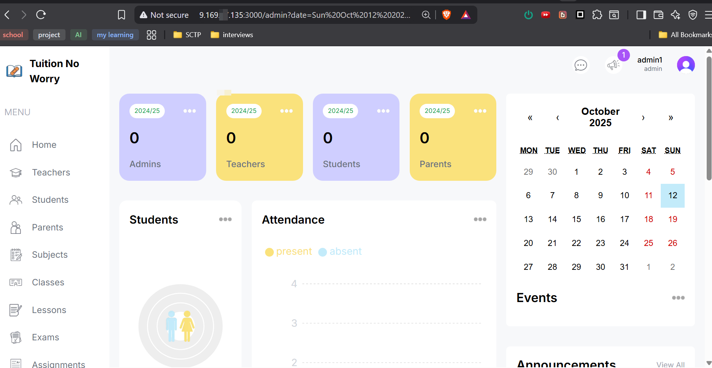

testing site to confirm deployment success

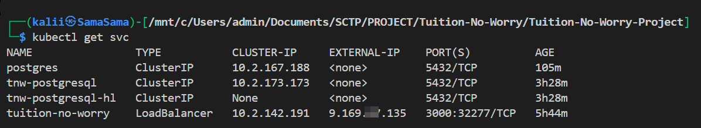

service details of cluster

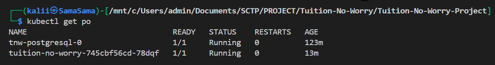

confirm stability of pods with no restarts

---

### 4. Key Takeaway

This debugging phase reinforced the complexity of **Private Link and DNS integration in AKS** environments and the importance of testing each layer iteratively.

By documenting both the challenge and the workaround, the demo now illustrates not only the deployment workflow but also the **real-world troubleshooting mindset** required in DevOps practice.

## Cleanup (reverse order)

```bash
cd tf-acr && terraform destroy -auto-approve -var="resource_group_name=$MAIN_RG"
cd tf-postgres && terraform destroy -auto-approve -var="resource_group_name=$MAIN_RG"
cd tf-aks && terraform destroy -auto-approve -var="resource_group_name=$MAIN_RG"
cd tf-aks-storage && terraform destroy -auto-approve -var="resource_group_name=$STORAGE_RG"
cd tf-iam && terraform destroy -auto-approve -var="resource_group_name=$MAIN_RG"
```

## Security notes

- Create UAMI first and attach to AKS for least-privilege pulls.
- Create ACR before role assignment step so the `AcrPul`l role can be granted.
- Private endpoint isolates DB from internet; seed & admin operations must run inside `VNet` or via trusted jumpbox.
- Use UAMI for least-privilege image pulls. For production CI, use OIDC/SP to obtain tokens (no long-lived secrets).
- Store secrets in `Key Vault` where possible. Use `tf-aks-storage` only for `tfstate` and artifacts, not for long-term secret storage unless keys are protected.

---

## 🚀 Future Improvements

While the current demo successfully validates the end-to-end DevOps workflow (Docker → ACR → AKS → Helm → Running Application), the following enhancements are planned to align the solution closer to production-grade standards:

### 1. **Private Database Connectivity**

Revisit integration with **Azure Database for PostgreSQL Flexible Server** using:

- **Private Endpoint** and **Private DNS Zone Link** for network-isolated access from AKS.
- **User-Assigned Managed Identity (UAMI)** for secure connection string retrieval from Azure Key Vault.

    This will fully align the deployment with enterprise-grade security and PDPA compliance.

---

### 2. **Refine Infrastructure-as-Code Modules**

Modularize Terraform scripts to improve maintainability and reproducibility:

- Separate state management into a secure remote backend (e.g., Azure Storage with state lock).
- Implement validation stages (`terraform plan` gates) in the CI/CD workflow before applying infrastructure changes.
- Integrate `tfsec` or `checkov` for automated IaC policy compliance checks.

---

### 3. **Observability and Alerting**

Expand monitoring coverage to align with the future-state architecture proposal:

- Enable **Prometheus + Managed Grafana** for pod-level metrics and dashboards.
- Set up **Azure Monitor Alerts** and custom SLO-based notifications (e.g., API latency, DB connection errors).
- Introduce **structured logging** to capture app-level events for debugging and audit.

---

### 4. **Resilience and Scalability**

Simulate production load and validate:

- **Horizontal Pod Autoscaler (HPA)** and **Cluster Autoscaler** behavior under stress.
- **PodDisruptionBudgets (PDBs)** and **Readiness/Liveness probes** to ensure fault tolerance.
- Optionally, test **multi-node scaling** to simulate 10k–100k concurrent user scenarios planned for the future-state design.

---

### 5. **Security Hardening**

- Enforce Azure Policy add-ons for AKS (e.g., restricted container privileges, namespace isolation).
- Sign container images with **Cosign** and generate **SBOMs (Software Bill of Materials)** for supply chain integrity.
- Integrate continuous container vulnerability scanning (Trivy or Aqua Security) into the CI pipeline.