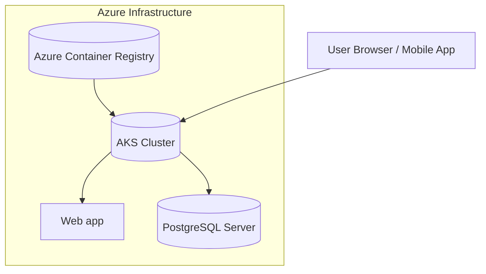

# README_Local

## 📘 Tuition-No-Worry Project

**A Containerized Tuition Centre Management System deployed on Azure Kubernetes Service (AKS)
This readme is for local setup.
(**Detailed walkthrough for ACR_AKS setup is at: [README_ACR_AKS.md](https://github.com/james-l-online/Tuition-No-Worry-Project/blob/starter/README_ACR_AKS.md))

---

### 🧭 Overview

This project is a **capstone simulation** designed to demonstrate a modern **DevOps workflow** for deploying a microservices-based Tuition Centre Management System on **Azure Kubernetes Service (AKS)**.

It models a realistic e-learning environment used by tuition centres in Singapore, supporting:

- Secure user authentication via **Clerk**
- Multi-service backend for scheduling, classes, and payments
- Containerized deployment using **Docker**, **Helm**, and **Terraform**
- CI/CD automation through **GitHub Actions**
- Secure image storage in **Azure Container Registry (ACR)**
- Cloud-native infrastructure hosted on **Azure**

> ⚙️ The focus is on DevOps practices — infrastructure automation, container management, and secure deployment — rather than on business logic.
> 

---

### 🚀 Project Scope

| Area | Description |
| --- | --- |
| **Goal** | To simulate a real-world DevOps deployment on AKS for a tuition centre platform. |
| **Demo Scale** | Student-demo setup (single-node AKS cluster) with end-to-end containerized deployment. |
| **Future Scale** | Designed for 10k–100k concurrent users with multi-node scaling, observability (Prometheus, Grafana, Azure Monitor), and secure networking (Front Door, App Gateway, Key Vault). |
| **DevOps Stack** | Docker, Terraform, Helm, GitHub Actions, Azure ACR & AKS. |

---

### 🧩 Architecture Snapshot

**Simplified AKS Architecture (Demo Version)**



> The current deployment represents a simplified demo architecture for instructional purposes.
> 
> 
> Detailed walkthrough for ACR_AKS setup is at:
> [README_ACR_AKS.md](https://github.com/james-l-online/Tuition-No-Worry-Project/blob/starter/README_ACR_AKS.md)
> 

---

### 🔐 Clerk Authentication Setup

The app uses **Clerk** for authentication and session management.

You **must configure Clerk environment variables** for the container to run successfully.

### 1. **Register and setup app in Clerk**

**Register for [Clerk Account](https://clerk.com/)**

- **Docker Compose example**

Replace values with your own in a local `.env` (do not commit secrets). Example placeholder:

```
DATABASE_URL=postgresql://<POSTGRES_USER>:<POSTGRES_PASSWORD>@postgres:5432/<POSTGRES_DB>?schema=public&sslmode=disable
```

---

**Create Test Users in Clerk**

- Go to "Users" in Clerk dashboard.
- Create user for role: `admin`
- Go into Profile. Scroll down to Metadata, then edit Public
- Set `public_metadata` for user:

```
{
"role": "admin"}
```

---

**Configure Clerk Session Claims**

- Go to Clerk dashboard → Configure → Session Management → Customize session token
- Add under Claims:

```
{
	"publicMetadata": {
		"role": "{{user.public_metadata.role}}"
	}
}
```

**Get Clerk API Keys**

- In Clerk dashboard —> configure —> API keys —> Publishable Key / Secret Key.

---

### 2. **Configure environment variables**

Create a **`.env`** at the repo root: (rename the provided .env.example to .env to use)

```bash
NEXT_PUBLIC_CLERK_PUBLISHABLE_KEY=pk_test_xxxxxxxxxxxxxxxxx
CLERK_SECRET_KEY=sk_test_xxxxxxxxxxxxxxxxx
NEXT_PUBLIC_CLERK_SIGN_IN_URL=/
```

> ⚠️ Without these keys, the containerized app will fail authentication and not start properly.
> 

---

### 🛠️ Tech Stack

| Category | Tools / Services |
| --- | --- |
| **Infrastructure** | Azure Kubernetes Service (AKS), Terraform, Helm |
| **CI/CD** | GitHub Actions |
| **Containerization** | Docker, Azure Container Registry (ACR) |
| **Authentication** | Clerk |
| **Database** | Azure PostgreSQL Flexible Server (Private Endpoint) |
| **Monitoring (Future-state)** | Prometheus, Grafana, Azure Monitor |
| **Networking (Future-state)** | Azure Front Door, App Gateway, Key Vault, NAT Gateway, Private Link |

---

### ⚙️ Setup (Local Setup)

### 🧱 Local (Docker)

1. Clone this repository
    
    ```bash
    git clone https://github.com/james-l-online/Tuition-No-Worry-Project.git
    cd Tuition-No-Worry-Project
    ```
    
2. Add your `.env` file with Clerk credentials as outlined in `.env.example`
3. Build and run locally with Docker Compose:
    
    ```bash
    # from repo root
    docker compose build --no-cache
    docker compose up -d
    
    # To run app, open in browser:
    [http://localhost:3000/](http://localhost:3000/)
    
    # login with your user you setup in Clerk
    ```
    

For detailed infrastructure and CI/CD automation steps, and provisioning via Terraform and deployment via Helm:

➡️ [README_ACR_AKS.md](https://github.com/james-l-online/Tuition-No-Worry-Project/blob/starter/README_ACR_AKS.md)

---

### 🧪 CI/CD Workflow Highlights

- **GitHub Actions** automate:
    - Docker build and image push to ACR
    - Terraform provisioning
    - Helm chart deployment to AKS
- **Security Scans**:
    - Runs `gitleaks` on pushes and PRs to protect against accidental secret commits.

---

### 🌐 Future-State Goals

- Multi-node AKS cluster with node pools (system + user)
- Secure networking (Front Door, App Gateway, Firewall, Key Vault)
- Observability with Prometheus, Grafana, Azure Monitor
- GitOps (Flux) for continuous deployment
- High Availability (HA) across zones
- PDPA-compliant DevSecOps posture

---

### 📄 Documentation Index

| Document | Description |
| --- | --- |
| `README.md` | Project overview (you are here) |
| `README_ACR_AKS.md` | Detailed Azure DevOps + AKS walkthrough |
| `infra/tf-* folders` | Terraform modules for ACR, AKS, IAM, PostgreSQL |
| `helm/` | Helm charts for microservices deployment |
| `diagrams/` | Mermaid and Draw.io system design visuals |

---

### 👤 Author

**James Lai**

[GitHub Profile](https://github.com/james-l-online) • [LinkedIn](https://www.linkedin.com/in/james-lai-ready4work/)